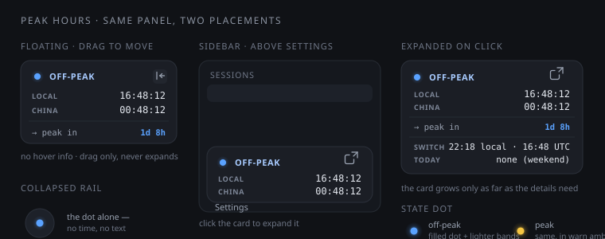

# dsh-peak-hour-tracker

A **DeepSeek Harness** plugin that tracks the time-based API discounts of
**DeepSeek** (peak / off-peak) and **Xiaomi MiMo** (Token Plan night discount).
One small panel, three stacked groups, always visible:

```
●  OFF-PEAK
LOCAL        16:48:12
CHINA        00:48:12
→ peak in       1d 8h
```

1. **the pricing state** — a filled dot circled by two lighter bands, in the
   harness's own business blue (discounted) or warn amber (full rate), labelled
   in the provider's own words (`OFF-PEAK` for DeepSeek, `NIGHT DISCOUNT` for MiMo)
2. **the clocks** — your local time and China (Beijing) time, stacked
3. **the countdown** — time until the window actually flips

[](https://github.com/mdfardeen11/dsh-peak-hour-tracker/actions/workflows/ci.yml)



## Features

- **Two providers**, switched automatically to match the model your session is
  using, with a manual pin when you want to plan around the other one.
- **Two placements**, switchable from the panel and remembered:
  - **Floating** — a draggable panel. Grab it anywhere, clamped to the viewport.
  - **Sidebar** — *the same panel* as a row in the sidebar foot, directly above
    Settings; collapse the sidebar and it becomes the coloured dot in the rail.
- **Click the sidebar panel** to expand it with the next switch instant (local
  and UTC), your local day's peak windows, and the pricing note.
- **No tooltips, no hover information** — details are on click.
- **Harness-native styling** — every colour, surface, border, radius and font
  comes from the live theme tokens, so it follows light/dark and the brand.
- **No network access, no telemetry.** The plugin reads nothing remote and
  writes only its own `localStorage` key (`dsh-peak-hour-tracker/prefs/v1`).

## Works anywhere in the world

The schedule is computed in **UTC**, exactly as DeepSeek publishes it, and the
local clock follows whatever zone you are actually in. Nothing in the plugin
assumes a country, a hemisphere, or a fixed offset.

Verified by [`test/run-timezones.mjs`](test/run-timezones.mjs), which re-runs the
zone-sensitive suite in a fresh process per zone — **25 zones, UTC-11 to UTC+14**,
including half-hour and 45-minute offsets and both hemispheres' daylight-saving
rules. The local peak windows shift with the zone, exactly as they should:

| Zone | Local peak windows |
|---|---|
| `Asia/Kolkata` (UTC+05:30) | 06:30–09:30 · 11:30–15:30 |
| `Asia/Kathmandu` (UTC+05:45) | 06:45–09:45 · 11:45–15:45 |
| `UTC` | 01:00–04:00 · 06:00–10:00 |
| `Asia/Shanghai` (UTC+08:00) | 09:00–12:00 · 14:00–18:00 |
| `Australia/Adelaide` (UTC+09:30) | 10:30–13:30 · 15:30–19:30 |
| `Pacific/Kiritimati` (UTC+14:00) | 15:00–18:00 · 20:00–00:00 |

The same run also asserts that the pricing state, the countdown and the China
clock are **identical in every zone**, that the local clock matches that zone's
own `Intl` output, and that the local-day scan still agrees with the rule across
four possible daylight-saving transition days (a 23- or 25-hour local day).

```bash
node test/run-timezones.mjs                        # all 25 zones
TZ=America/New_York node test/timezones.test.mjs   # just yours
```

## Two harness quirks this plugin works around

Both were found by reading the shipped stylesheets, not by guessing, and both are
locked by tests:

1. **Circles need `corner-shape:round`.** The harness shapes its UI with the CSS
   `corner-shape` property, so a plain `border-radius:50%` element inherits the
   app's squircle default and renders as a rounded square. Every circular element
   the harness ships opts back in explicitly — its own 8px status dot is
   `border-radius:50%;corner-shape:round` — and so do this plugin's dot and rail
   button.
2. **`--dsw-specific-menu` is a glass fill, not a surface.** It resolves to
   `#f8f9fa94` (58% opacity) in light and `#43454a73` (45%) in dark, and the
   harness always pairs it with a backdrop blur. Painting it alone lets the page
   show through the panel, so the panel paints an opaque
   `--dsw-alias-bg-layer-1` first and layers the menu tint over it with a
   gradient: faithful to the menu tone, and fully opaque.

## The schedules it encodes

| | DeepSeek (official API) | MiMo (Token Plan) |
|---|---|---|
| Discounted | everything except Mon–Fri 01:00–04:00 and 06:00–10:00 UTC; Chinese public holidays count as discounted | **daily** 16:00–24:00 UTC (Beijing 00:00–08:00) |
| Full rate | Mon–Fri 01:00–04:00, 06:00–10:00 UTC | daily 00:00–16:00 UTC |
| Weekday logic | Mon–Fri only | none |
| Discount | half price | 0.8× credits |
| Panel wording | `OFF-PEAK` / `PEAK` | `NIGHT DISCOUNT` / `FULL RATE` |

From the official DeepSeek API pricing page
([Models & Pricing](https://api-docs.deepseek.com/quick_start/pricing)):

> Off-peak rates are half of the peak rates. **Peak hours are 01:00–04:00 and
> 06:00–10:00 UTC, Monday through Friday, excluding Chinese public holidays. All
> other hours are off-peak, including weekends and Chinese public holidays in
> full.**

From the MiMo Token Plan FAQ
([Plans and Pricing](https://mimo.mi.com/docs/en-US/quick-start/faq/token-plan/Plans&Pricing)):

> **Night discount rate:** During off-peak hours (Beijing time 00:00–08:00, i.e.
> UTC 16:00–24:00), the Credits consumption coefficient is 0.8x.

Chinese public holidays are **not** computed — that needs a yearly calendar. Put
the dates in `CHINESE_HOLIDAY_YMD` in [`lib/client.js`](lib/client.js) as
`"YYYY-MM-DD"` Beijing dates and those days count as off-peak.

### Which schedule is shown, and where a discount does *not* apply

A discount is a property of the **route you buy through**, not of a model name:

- MiMo's 0.8× night rate is a **Token Plan** feature. The
  [pay-as-you-go pricing](https://mimo.mi.com/docs/en-US/price/pay-as-you-go) is
  flat — no time-based discount at all — and is explicitly "not interoperable
  with the Token Plan package quota".
- DeepSeek's peak/off-peak pricing is the **official API's**. Resellers set their
  own terms and some publish different windows.

The panel therefore follows the **provider id your session is using** (read from
the harness's `modelSelection` projection), and shows that provider's caveat when
you expand the panel. It cannot see your account plan — which plan you bought is
account state, not session state — so if you are on MiMo pay-as-you-go, read the
MiMo countdown as "when the Token Plan would be cheaper", not as your own bill.
An unrecognised provider says `NO TIMED DISCOUNT` rather than showing a countdown
that would be wrong. `Follow session` / `DeepSeek` / `MiMo` in the expanded panel
pins the schedule manually when detection is not what you want.

## Requirements

- A DeepSeek Harness `web` profile (any OS — Windows, macOS, Linux).
- For the script install: Node on `PATH` (the harness already requires it).
- For the `dsh plugin` install: `pnpm` on `PATH`.
- A browser with `color-mix` support (Chrome/Edge 111+, Safari 16.2+,
  Firefox 113+). Older browsers still work; the dot simply draws without its
  lighter bands.

## Install

### Option A — the standard harness route (recommended)

```bash
dsh plugin --profile web add github:mdfardeen11/dsh-peak-hour-tracker
```

or from a local clone:

```bash
git clone https://github.com/mdfardeen11/dsh-peak-hour-tracker
dsh plugin --profile web add ./dsh-peak-hour-tracker
```

`dsh plugin` forwards to pnpm inside the profile directory and reconciles the
layer list, so this installs the package and adds `dsh-peak-hour-tracker` to the
profile's `dsh.profile.bundles`. Because [`cordis.patch.yml`](cordis.patch.yml)
is declared as the package's bundle patch, that is what inserts the Loader entry.

**A git install needs no build allowance.** pnpm ≥10 makes users explicitly
allow a git dependency's `prepare` script — permission to run that package's code
at install time — and most TypeScript plugins need it because a git fetch brings
sources, not build output. This package ships its built `lib/` and declares **no
`prepare` script**, so there is nothing to allowlist: `add` just works.

This route needs a **harness restart** (bundle layers are read at boot).

### Option B — no pnpm, live reload

If `pnpm` is not on `PATH` (or you would rather not restart), the included
scripts copy the package into the profile and add the Loader entry straight to
the profile's own patch layer, which reloads live:

```powershell
# Windows
pwsh -File install.ps1
```

```bash
# macOS / Linux
chmod +x install.sh uninstall.sh
./install.sh
```

Both accept a profile name (`pwsh -File install.ps1 -Profile web`,
`./install.sh web`) and honour `DSH_HOME`. They are idempotent, and they detect
an Option A install and leave it alone rather than inserting a duplicate entry.

**Then refresh the browser once** (`Ctrl+R`) if the tracker is not already
visible. After that it stays mounted; later edits hot-swap into the open page
without a refresh.

### Option C — a prebuilt tarball

The same advantage as Option A with no git fetch and no registry: install the
packaged tarball (attached to each
[release](https://github.com/mdfardeen11/dsh-peak-hour-tracker/releases), or built
locally with `npm pack`).

```bash
dsh plugin --profile web add ./dsh-peak-hour-tracker-1.0.0.tgz
```

Needs a harness restart, like Option A.

### Uninstall

```powershell
pwsh -File uninstall.ps1                                  # Windows
```

```bash
./uninstall.sh                                            # macOS / Linux
dsh plugin --profile web remove dsh-peak-hour-tracker     # Option A installs
```

## After installing: the Plugins settings section

Open **Settings → Plugins**. The plugin appears automatically in the
**Plugin list** tab — that tab is a read-only projection of the host's live
Loader inventory, so anything loaded shows up there with its package name, entry
id (`ui-peak-hours`), enablement and runtime status. There is no registry to
submit to and no approval step.

The **Plugin configuration** tab is only for plugins that expose host settings;
this one has no options, so it deliberately has no card there.

## How it plugs in

- `lib/index.js` — the node half. Empty on purpose: the package only has to be a
  Loader entry so the host's client-module scan finds it.
- `lib/client.js` — the browser half, requiring only `react`. Both placements
  render the same `Panel` component, and both register into **list** slots, so
  they are additive and never shadow shipped UI:

  ```js
  ctx.slots.inject("shell.overlay", () =>
    ctx.slots.register({ name: "shell.overlay", id: "peak-hours", order: 40 }, OverlayRoot));
  ctx.slots.inject("sidebar.footer.action", () =>
    ctx.slots.register({ name: "sidebar.footer.action", id: "peak-hours", order: 10 }, SidebarEntry));
  ```

- `cordis.patch.yml` — the profile layer Option A installs.
- `scripts/patch-profile.mjs` — the one place the install scripts edit a profile
  patch file, so comments and other entries survive untouched.

## Tests

```bash
node test/logic.test.mjs        # behavioural checks, both providers
node test/run-timezones.mjs     # the same zone-sensitive checks in 25 zones
```

No dependencies and no install step: the bundle is a browser classic script, so
[`test/harness.mjs`](test/harness.mjs) stubs `window.__ModuleLoader__`, React,
`localStorage` and `document`, then drives the real components through their own
handlers. Coverage includes the schedule cases, the three stacked groups, the
state dot and its CSS, the placement icons, drag-and-clamp with a persisted
position, the rail fallback, click-to-expand, and that both placements render
identical content.

## Troubleshooting

| Symptom | Fix |
|---|---|
| Nothing appears after install | Refresh the page once (`Ctrl+R`). A newly added Loader row only reaches an already-open page on reload. |
| Not in **Settings → Plugins → Plugin list** | The entry is not composed. Check that the profile's `cordis.patch.yml` names the package, and that the package is in the profile's `node_modules`. |
| Two panels appear | A manual row and a bundle layer both exist. Remove the row from the profile's `cordis.patch.yml` (Option A installs provide it), or run the matching uninstall script. |
| Panel disappeared after uninstalling | The host still holds the stale entry. Restart the harness, or re-install and uninstall again in order — the uninstall script waits for the live patch watcher first. |
| Times look wrong | The plugin follows the harness process's time zone. Set `TZ` for that process or change the OS zone, then reload. |

## Customising

Edit [`lib/client.js`](lib/client.js) and re-run the installer (Option B
hot-swaps live):

| Want | Change |
|---|---|
| A different corner | `right` / `bottom` on `.dph-float` |
| Different colours | `--dph-off` / `--dph-on` in the `TOKENS` constant |
| Wider or tighter dot bands | the `2px` / `4px` spreads on `.dph-dot` |
| More space between labels and values | `column-gap` on `.dph-times` |
| A different schedule | `PEAK_WINDOWS_UTC_MIN`, `PEAK_WEEKDAYS_UTC` |
| Chinese public holidays as off-peak | `CHINESE_HOLIDAY_YMD` |
| Order in the sidebar foot | the `order` on the `sidebar.footer.action` registration |

## Releasing (maintainers)

There is no build step and no bundler: `lib/` is the shipped artifact. To cut a
release:

```bash
npm version patch            # or minor / major — updates package.json + git tag
npm test                     # both suites
npm pack                     # -> dsh-peak-hour-tracker-<version>.tgz
npm publish                  # optional: makes `dsh plugin add dsh-peak-hour-tracker` work by name
gh release create v<version> dsh-peak-hour-tracker-<version>.tgz
```

Attach the tarball to the GitHub Release rather than committing it; `*.tgz` is
gitignored for that reason.

## Licence

[MIT](LICENSE) — use it, fork it, ship it.

Not affiliated with DeepSeek. It displays a schedule DeepSeek publishes and can
change; the "half price" wording is theirs, not a promise made here.
